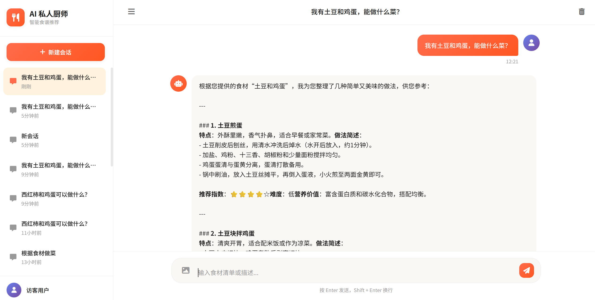

# Personal Chief - 个人私厨项目介绍文档

## 界面

## 一、项目概述

Personal Chief 是一个基于 AI 智能体的个人私厨助手应用。用户可以通过上传食材照片或输入食材清单，系统会智能识别食材、搜索相关食谱，并根据营养价值和制作难度进行评估排序，最终输出结构化的食谱建议报告。

### 核心功能
- 食材图片识别与评估
- 智能食谱检索
- 多维度食谱评估与排序
- 流式对话交互
- 会话历史管理

---

## 二、技术栈

### 后端框架
| 技术 | 版本 | 用途 |
|------|------|------|
| Python | >=3.14 | 编程语言 |
| FastAPI | >=0.135.3 | Web 框架，提供 REST API |
| Uvicorn | - | ASGI 服务器 |
| Pydantic | >=2.0.0 | 数据验证与序列化 |

### AI/LLM 相关
| 技术 | 版本 | 用途 |
|------|------|------|
| LangChain Community | >=0.4.1 | LLM 应用开发框架 |
| LangGraph CLI | >=0.4.19 | 智能体编排框架 |
| LangChain OpenAI | >=1.1.12 | OpenAI 兼容接口适配 |
| LangChain DeepSeek | >=1.0.1 | DeepSeek 模型适配 |
| LangChain Tavily | >=0.2.17 | Tavily 搜索工具集成 |
| LangGraph Checkpoint SQLite | >=3.0.3 | 会话持久化存储 |
| DashScope | >=1.25.15 | 阿里云 AI 服务 SDK |

### 数据存储
| 技术 | 用途 |
|------|------|
| SQLite | 会话状态持久化存储 |

---

## 三、方案设计

### 3.1 系统架构图

```
┌─────────────────────────────────────────────────────────────────┐
│                         客户端 (前端)                            │
│                    上传图片 / 发送文本消息                         │
└─────────────────────────────┬───────────────────────────────────┘
                              │ HTTP/SSE
                              ▼
┌─────────────────────────────────────────────────────────────────┐
│                      FastAPI 应用层                              │
│  ┌─────────────────┐  ┌─────────────────┐  ┌─────────────────┐ │
│  │   main.py       │  │   api/chat.py   │  │ models/schemas  │ │
│  │   应用入口       │  │   路由处理       │  │   数据模型       │ │
│  └─────────────────┘  └─────────────────┘  └─────────────────┘ │
└─────────────────────────────┬───────────────────────────────────┘
                              │
                              ▼
┌─────────────────────────────────────────────────────────────────┐
│                      Agent 智能体层                              │
│  ┌─────────────────────────────────────────────────────────────┐│
│  │              personal_chief.py (LangGraph Agent)            ││
│  │  ┌───────────────┐  ┌───────────────┐  ┌───────────────┐   ││
│  │  │  多模态模型    │  │  Web Search   │  │  Checkpointer │   ││
│  │  │ (Qwen3-Omni)  │  │  (Tavily)     │  │  (SQLite)     │   ││
│  │  └───────────────┘  └───────────────┘  └───────────────┘   ││
│  └─────────────────────────────────────────────────────────────┘│
└─────────────────────────────────────────────────────────────────┘
```

### 3.2 项目目录结构

```
personal_chief/
├── app/
│   ├── __init__.py
│   ├── main.py                 # FastAPI 应用入口
│   ├── agent/
│   │   └── personal_chief.py   # 智能体定义与配置
│   ├── api/
│   │   ├── __init__.py
│   │   └── chat.py             # 聊天相关 API 路由
│   ├── common/
│   │   ├── __init__.py
│   │   └── logger.py           # 日志配置模块
│   ├── models/
│   │   ├── __init__.py
│   │   └── schemas.py          # Pydantic 数据模型
│   └── db/
│       └── personal_chief.db    # SQLite 数据库文件
├── .env                        # 环境变量配置
├── langgraph.json              # LangGraph 配置文件
├── pyproject.toml              # 项目依赖配置
└── uv.lock                     # UV 锁文件
```

### 3.3 核心处理流程

```
用户请求 → 图片/文本输入 → 多模态模型识别食材
                              ↓
                    调用 Tavily 搜索食谱
                              ↓
                    营养价值与难度评估排序
                              ↓
                    结构化报告输出 (流式响应)
```

---

## 四、技术点详解

### 4.1 多模态模型集成

项目使用阿里云通义千问多模态模型 `qwen3-omni-flash`，支持图片、文本、音频、视频等多种输入格式：

```python
multimodal_mode = init_chat_model(
    model="qwen3-omni-flash",
    model_provider="openai",
    api_key=os.getenv("DASHSCOPE_API_KEY"),
    base_url="https://dashscope.aliyuncs.com/compatible-mode/v1",
)
```

通过 OpenAI 兼容接口调用，便于后续切换其他模型。

### 4.2 LangGraph 智能体构建

使用 LangGraph 的 `create_agent` 快速构建具备工具调用能力的智能体：

```python
agent = create_agent(
    model=multimodal_mode,
    system_prompt=system_prompt,
    tools=[web_search],
    checkpointer=checkpointer
)
```

**核心特性：**
- 自动处理工具调用循环
- 内置会话状态管理
- 支持流式输出

### 4.3 Tavily 搜索工具

集成 Tavily 搜索引擎，用于食谱检索：

```python
web_search = TavilySearch(max_results=5, topic="general")
```

Tavily 是专为 AI 应用优化的搜索 API，返回结构化的搜索结果。

### 4.4 会话持久化

使用 SQLite 作为 Checkpointer 存储会话状态：

```python
checkpointer = SqliteSaver(sqlite3.connect(DB_PATH, check_same_thread=False))
checkpointer.setup()
```

**优势：**
- 轻量级，无需额外数据库服务
- 支持多线程访问
- 自动持久化对话历史

### 4.5 流式响应 (SSE)

采用 Server-Sent Events 实现流式输出，提升用户体验：

```python
async def stream_agent_response(request: ChatRequest):
    stream_response = agent.stream(
        {"messages": request.message},
        stream_mode="messages",
        config={"configurable": {"thread_id": request.thread_id}}
    )
    for chunk in stream_response:
        if chunk and hasattr(chunk[0], 'content'):
            yield chunk[0].content
```

### 4.6 Prompt Engineering

系统提示词设计遵循结构化流程：

```
1. 识别和评估食材 → 2. 智能食谱检索 → 3. 多维度评估排序 → 4. 结构化输出
```

明确指导模型优先调用工具搜索，而非自行生成内容。

---

## 五、接口文档

### 基础信息

- **Base URL**: `http://127.0.0.1:8001`
- **Content-Type**: `application/json`

### 5.1 首页

**GET** `/`

检查服务状态。

**响应示例：**
```json
{
  "message": "服务正常运行！"
}
```

---

### 5.2 流式对话

**POST** `/api/chat/stream`

发送消息并获取流式响应。

**请求体：**
```json
{
  "message": "我有土豆和鸡蛋，能做什么菜？",
  "image_url": "https://example.com/food.jpg",
  "thread_id": "uuid-string-here"
}
```

**参数说明：**

| 参数 | 类型 | 必填 | 说明 |
|------|------|------|------|
| message | string | 是 | 用户输入的文本信息 |
| image_url | string | 否 | 用户上传的图片 URL，为空则纯文本对话 |
| thread_id | string | 是 | 对话线程 ID，前端生成唯一 ID（如 UUID） |

**响应：**

流式返回文本内容，Content-Type 为 `text/plain; charset=utf-8`。

**请求示例：**

```bash
curl -X POST "http://127.0.0.1:8001/api/chat/stream" \
  -H "Content-Type: application/json" \
  -d '{
    "message": "我有土豆和鸡蛋，能做什么菜？",
    "thread_id": "test-thread-001"
  }'
```

---

### 5.3 获取历史消息

**GET** `/api/chat/messages`

获取指定线程的历史消息。

**查询参数：**

| 参数 | 类型 | 必填 | 说明 |
|------|------|------|------|
| thread_id | string | 是 | 对话线程 ID |

**响应示例：**
```json
[
  {
    "role": "user",
    "content": "我有土豆和鸡蛋，能做什么菜？"
  },
  {
    "role": "assistant",
    "content": "根据您提供的食材..."
  }
]
```

**请求示例：**
```bash
curl "http://127.0.0.1:8001/api/chat/messages?thread_id=test-thread-001"
```

---

### 5.4 清空历史消息

**DELETE** `/api/chat/clear`

清空指定线程的历史消息。

**查询参数：**

| 参数 | 类型 | 必填 | 说明 |
|------|------|------|------|
| thread_id | string | 是 | 对话线程 ID |

**响应示例：**
```json
{
  "message": "历史消息已清空"
}
```

**请求示例：**
```bash
curl -X DELETE "http://127.0.0.1:8001/api/chat/clear?thread_id=test-thread-001"
```

---

### 5.5 获取所有历史会话列表

**GET** `/api/chat/sessions`

获取所有历史会话列表，用于侧边栏显示。

**响应示例：**
```json
[
  {
    "thread_id": "test-thread-001",
    "title": "我有土豆和鸡蛋，能做什么菜？"
  },
  {
    "thread_id": "test-thread-002",
    "title": "西红柿和鸡蛋可以做什么？"
  }
]
```

**请求示例：**
```bash
curl "http://127.0.0.1:8001/api/chat/sessions"
```

---

## 六、环境配置

### 6.1 环境变量

创建 `.env` 文件，配置以下环境变量：

```env
DASHSCOPE_API_KEY=your_dashscope_api_key
TAVILY_API_KEY=your_tavily_api_key
```

### 6.2 启动方式

```bash
# 安装依赖
uv sync

# 启动服务
python -m app.main
```

服务将在 `http://127.0.0.1:8001` 启动。

### 6.3 API 文档访问

启动服务后，可访问自动生成的 API 文档：

- Swagger UI: `http://127.0.0.1:8001/docs`
- ReDoc: `http://127.0.0.1:8001/redoc`

