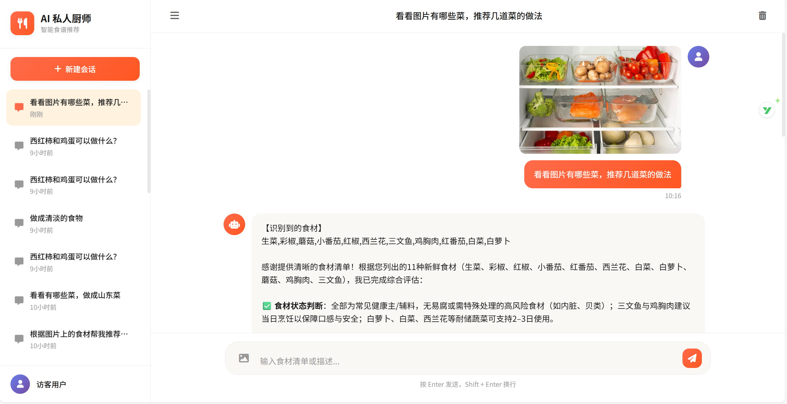
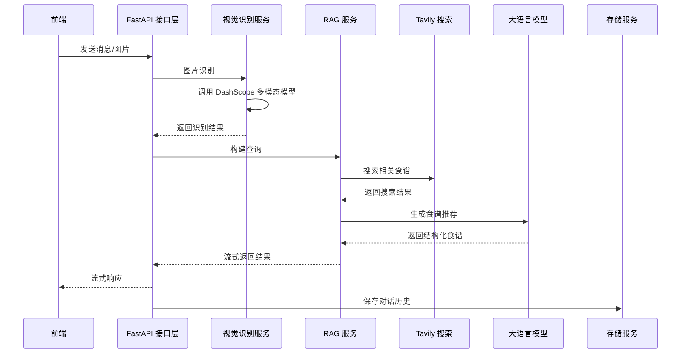

# Personal Chief - AI 智能私厨助手

## 项目简介

Personal Chief 是一款基于 AI 技术的智能私厨助手应用，旨在帮助用户根据现有食材快速获取个性化的食谱推荐。通过上传食材照片或输入食材清单，系统能够智能识别食材、搜索相关食谱，并根据营养价值和制作难度进行评估排序，最终输出结构化的食谱建议报告。




## 核心功能

- **多模态食材识别**：支持上传食材图片，通过 AI 模型智能识别食材种类和数量
- **智能食谱推荐**：根据识别的食材，结合用户需求，推荐最适合的食谱
- **多维度评估**：从营养价值、制作难度等维度对食谱进行评估和排序
- **流式对话交互**：采用 SSE 技术实现流式响应，提供实时的对话体验
- **会话历史管理**：支持查看、清空和删除历史会话记录
- **响应式设计**：适配桌面端和移动端设备

## 技术架构

### 技术栈

| 类别 | 技术 | 版本 | 用途 |
|------|------|------|------|
| **后端框架** | Python | >=3.14 | 编程语言 |
| | FastAPI | >=0.135.3 | Web 框架，提供 REST API |
| | Uvicorn | - | ASGI 服务器 |
| | Pydantic | >=2.0.0 | 数据验证与序列化 |
| **AI/LLM 相关** | LangChain | >=0.4.1 | LLM 应用开发框架 |
| | LangGraph | >=0.4.19 | 智能体编排框架 |
| | DashScope | >=1.25.15 | 阿里云 AI 服务 SDK |
| | Tavily API | - | 智能搜索工具 |
| **数据存储** | SQLite | - | 会话状态持久化 |
| | File Storage | - | 历史消息存储 |
| **前端技术** | HTML5/CSS3 | - | 页面结构和样式 |
| | JavaScript | - | 前端交互逻辑 |
| | Font Awesome | 6.4.0 | 图标库 |

### 系统架构



### 项目结构

```
personal_chief/
├── app/                     # 应用主目录
│   ├── __init__.py          # 包初始化文件
│   ├── main.py              # FastAPI 应用入口
│   ├── api/                 # API 路由层
│   │   ├── __init__.py
│   │   └── chat.py          # 聊天相关 API 路由
│   ├── common/              # 公共模块
│   │   ├── __init__.py
│   │   └── logger.py        # 日志配置
│   ├── data/                # 数据存储目录
│   │   ├── chat_history/    # 聊天历史记录
│   │   └── chroma_db/       # Chroma 向量数据库
│   ├── models/              # 数据模型
│   │   ├── __init__.py
│   │   └── schemas.py       # Pydantic 数据模型
│   ├── rag/                 # RAG 服务
│   │   ├── __init__.py
│   │   ├── config_data.py   # RAG 配置
│   │   ├── rag.py           # RAG 服务实现
│   │   ├── history/         # 历史记录服务
│   │   │   ├── __init__.py
│   │   │   └── file_history_store.py
│   │   ├── service/         # 业务服务
│   │   │   ├── __init__.py
│   │   │   ├── vectore_stores.py
│   │   │   └── vision.py
│   │   └── upload/          # 上传相关
│   │       ├── __init__.py
│   │       ├── app_file_upload.py
│   │       ├── knowledge_base.py
│   │       └── md5.txt
│   └── static/              # 静态文件
│       ├── css/             # 样式文件
│       ├── images/          # 图片文件
│       ├── js/              # JavaScript 文件
│       └── index.html       # 前端页面
├── .env                     # 环境变量配置
├── langgraph.json           # LangGraph 配置文件
├── pyproject.toml           # 项目依赖配置
├── uv.lock                  # UV 锁文件
└── README.md                # 项目说明文档
```

## 工作原理

### 1. 多模态食材识别

当用户上传食材图片时，系统使用阿里云通义千问的 `qwen3-omni-flash` 多模态模型进行识别。该模型能够准确识别图片中的食材种类、数量和状态，为后续的食谱推荐提供基础数据。

### 2. 智能食谱检索

系统集成了 Tavily 搜索引擎，根据识别的食材和用户需求，搜索相关的食谱信息。Tavily 专为 AI 应用优化，返回结构化的搜索结果，提高了食谱推荐的准确性和相关性。

### 3. 多维度评估与排序

系统从以下维度对食谱进行评估：
- **营养价值**：分析食谱的营养成分和健康程度
- **制作难度**：评估食谱的制作步骤复杂度和所需时间
- **食材匹配度**：计算食谱与用户提供食材的匹配程度
- **口味偏好**：考虑用户的口味偏好和饮食习惯

### 4. 结构化输出

系统将评估结果整理为结构化的食谱建议报告，包括：
- 食谱名称和简介
- 详细的制作步骤
- 所需食材和调料
- 烹饪时间和难度
- 营养价值分析
- 小贴士和注意事项

## API 接口

### 基础信息

- **Base URL**: `http://127.0.0.1:8001`
- **Content-Type**: `application/json`

### 接口列表

| 接口 | 方法 | 路径 | 功能 |
|------|------|------|------|
| 首页 | GET | `/` | 检查服务状态 |
| 流式对话 | POST | `/api/chat/stream` | 发送消息并获取流式响应 |
| 获取历史消息 | GET | `/api/chat/messages` | 获取指定线程的历史消息 |
| 清空历史消息 | DELETE | `/api/chat/clear` | 清空指定线程的历史消息 |
| 删除会话 | DELETE | `/api/chat/delete_by_thread_id` | 删除指定线程的所有记录 |
| 获取会话列表 | GET | `/api/chat/sessions` | 获取所有历史会话列表 |

### 流式对话接口

**请求体：**
```json
{
  "message": "我有土豆和鸡蛋，能做什么菜？",
  "image_url": "data:image/jpeg;base64,/9j/4AAQSkZJRgABAQEASABIAAD...",
  "thread_id": "uuid-string-here"
}
```

**参数说明：**
- `message`：用户输入的文本信息（必填）
- `image_url`：用户上传的图片 URL 或 base64 编码（可选）
- `thread_id`：对话线程 ID，前端生成唯一 ID（必填）

**响应：**
流式返回文本内容，Content-Type 为 `text/plain; charset=utf-8`。

## 环境配置

### 1. 环境变量

创建 `.env` 文件，配置以下环境变量：

```env
# 阿里云 DashScope API 密钥
DASHSCOPE_API_KEY=your_dashscope_api_key

# Tavily 搜索 API 密钥
TAVILY_API_KEY=your_tavily_api_key

# DashScope SDK 基础 URL
DASHSCOPE_SDK_BASE_URL=https://dashscope.aliyuncs.com/api/v1
```

### 2. 依赖安装

使用 UV 包管理器安装项目依赖：

```bash
# 安装依赖
uv sync
```

### 3. 启动服务

```bash
# 启动服务
python -m app.main
```

服务将在 `http://127.0.0.1:8001` 启动。

### 4. API 文档

启动服务后，可访问自动生成的 API 文档：
- Swagger UI: `http://127.0.0.1:8001/docs`
- ReDoc: `http://127.0.0.1:8001/redoc`

## 快速开始

1. **配置环境变量**：创建 `.env` 文件并填写 API 密钥
2. **安装依赖**：运行 `uv sync` 安装项目依赖
3. **启动服务**：运行 `python -m app.main` 启动服务
4. **访问应用**：在浏览器中打开 `http://127.0.0.1:8001`
5. **开始使用**：
   - 输入食材清单，如 "我有土豆和鸡蛋，能做什么菜？"
   - 或上传食材图片，系统会自动识别食材并推荐食谱
   - 查看推荐的食谱详情和制作步骤

## 技术亮点

1. **多模态融合**：结合文本和图像输入，提供更全面的用户体验
2. **流式响应**：采用 SSE 技术实现实时对话，提升用户体验
3. **智能搜索**：集成 Tavily 搜索，获取最新、最相关的食谱信息
4. **多维度评估**：从多个角度评估食谱，提供个性化推荐
5. **会话管理**：完善的会话历史管理功能，方便用户回顾和管理对话
6. **响应式设计**：适配不同设备尺寸，提供一致的用户体验
7. **模块化架构**：清晰的代码结构，便于维护和扩展

## 未来规划

- [ ] 支持更多语言和地区的食谱推荐
- [ ] 集成用户反馈机制，不断优化推荐算法
- [ ] 增加食材营养分析和健康建议功能
- [ ] 支持用户保存和分享喜欢的食谱
- [ ] 开发移动应用，提供更便捷的使用体验
- [ ] 增加社区功能，允许用户分享自己的食谱和烹饪经验

## 贡献指南

欢迎对项目进行贡献！如果您有任何建议或问题，请通过以下方式联系我们：

- 提交 Issue 报告 bug 或提出新功能建议
- 提交 Pull Request 贡献代码
- 参与项目讨论，分享您的想法和建议

## 许可证

本项目采用 MIT 许可证，详情请参阅 LICENSE 文件。

---

**Personal Chief** - 让烹饪变得简单而有趣！🍳✨